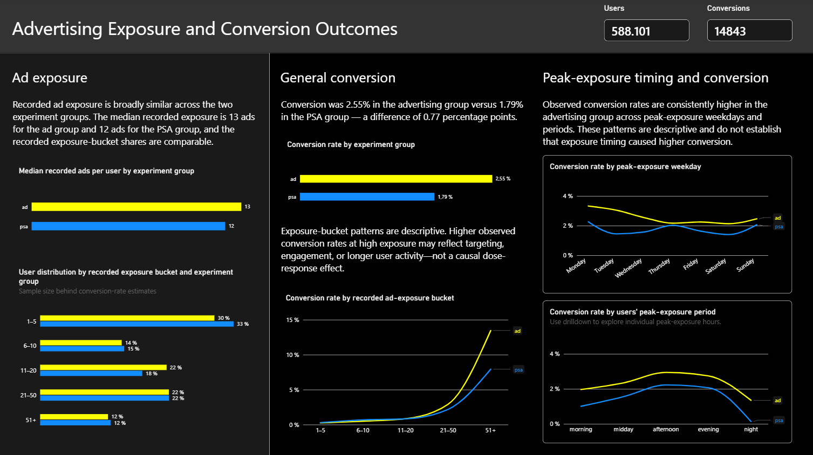

# Advertising Experiment Analysis

Power BI report analysing advertising exposure, user engagement, conversion outcomes, and incremental profitability for an advertising treatment group (`ad`) and a PSA control group (`psa`).

The report combines an executive-level dashboard overview with a more detailed user-level analysis of recorded exposure and conversion patterns.

## Dashboard pages

### 1. Dashboard overview


The overview page provides a high-level summary of the experiment, user engagement, conversion outcomes, and financial implications of the advertising treatment.

It is designed to answer the following stakeholder questions:

- How large is the experiment population?
- How do the advertising treatment and PSA control groups compare?
- What do user intensity and relative app-engagement patterns look like?
- What is the observed conversion lift?
- Does the incremental value generated by the advertising treatment exceed media cost?
- How does incremental profit change under different media-cost and conversion-lift assumptions?

The page includes an **Incrementality Profitability Simulation**. Users can adjust the main assumptions:

- Number of users.
- Value per conversion.
- Media cost expressed as CPM.

Based on the selected assumptions, the simulation estimates:

- Incremental conversions.
- Incremental value.
- Media cost.
- Incremental profit.
- Return on investment (ROI).
- Break-even CPM.

The waterfall visual reconciles the financial outcome:

```text
Incremental value
− Media cost
= Incremental profit
```

The scenario charts additionally show how incremental profit and break-even CPM vary across optimistic, base-estimate, and conservative conversion-lift scenarios.

### 2. Exposure and conversion overview



The exposure and conversion page examines recorded ad exposure and observed conversion outcomes at the user-segment level.

- **Ad exposure:** Median recorded exposure is 13 ads in the advertising group and 12 ads in the PSA group. Exposure-bucket distributions are broadly comparable.
- **General conversion:** Conversion is 2.55% in the advertising group versus 1.79% in the PSA control group — an observed difference of 0.77 percentage points.
- **Exposure buckets:** Conversion rates increase in the highest recorded-exposure bucket. This pattern is descriptive and may reflect targeting, engagement, or longer user activity rather than a causal effect of additional ads.
- **Peak-exposure timing:** Conversion rates vary by users’ peak-exposure weekday and time period. The advertising group remains above the PSA group across the displayed categories.

## Key results

| Topic | Result |
|---|---|
| Experiment population | 588,101 users and 14,843 conversions |
| Recorded ad exposure | Median of 13 ads for `ad` users and 12 ads for `psa` users |
| Advertising-group conversion | 2.55% |
| PSA-group conversion | 1.79% |
| Observed absolute difference | 0.77 percentage points in favour of the advertising group |
| Observed incremental lift | 0.769 percentage points, with a 95% confidence interval from 0.587 to 0.936 percentage points |
| Example incremental conversions | 769 under the selected simulation assumptions |
| Example media cost | $800 under the selected simulation assumptions |
| Example incremental profit | Approximately $3K under the selected simulation assumptions |
| Example ROI | 3.81 under the selected simulation assumptions |

## How to interpret the report

- The comparison between the advertising treatment (`ad`) and PSA control (`psa`) groups is the primary experiment result.
- The observed conversion-rate difference is interpreted as incremental lift relative to the PSA control group.
- Incremental value is estimated by applying the value-per-conversion assumption to the estimated incremental conversions.
- Incremental profit is calculated as incremental value minus media cost.
- ROI and break-even CPM depend on the assumptions selected in the profitability simulation.
- The profitability simulation is a scenario-planning tool and should not be interpreted as a production budget-allocation model.
- Recorded exposure buckets and peak-exposure time categories are **descriptive user segments**, not randomized treatment levels.
- Consequently, higher conversion at high recorded exposure should not be interpreted as proof that increasing frequency caused a user to convert.
- Peak-exposure timing represents the day or period when a user had their highest recorded exposure; it is not a chronological campaign-delivery trend.
- Conversion-rate differences are shown in percentage points.

## Tools

- Python
- pandas and NumPy
- SciPy and/or statsmodels
- matplotlib and seaborn
- Power BI and DAX for the dashboard and profitability-simulation prototype
- Git and GitHub

## Repository structure

```text
.
├── 01_data/
│   ├── 01_raw/              # Original source data; not committed
│   └── 02_processed/        # Processed data; not committed
├── 02_notebooks/            # Data validation, analysis, and statistical testing
├── 03_outputs/              # Tables and static figures
├── 04_dashboard/            # Power BI files; not committed
├── 05_screenshots/          # Dashboard and analysis screenshots
└── README.md
```

## Notes

- This is a portfolio and decision-support project, not a production budget-allocation system.
- The conversion comparison is based on the advertising treatment and PSA control groups.
- Exposure-bucket and peak-exposure timing analyses are descriptive and should not be interpreted as causal dose-response analyses.
- Profitability results depend on the selected number of users, value per conversion, CPM, and conversion-lift assumptions.
- Currency values and scenario outputs are illustrative unless otherwise specified.