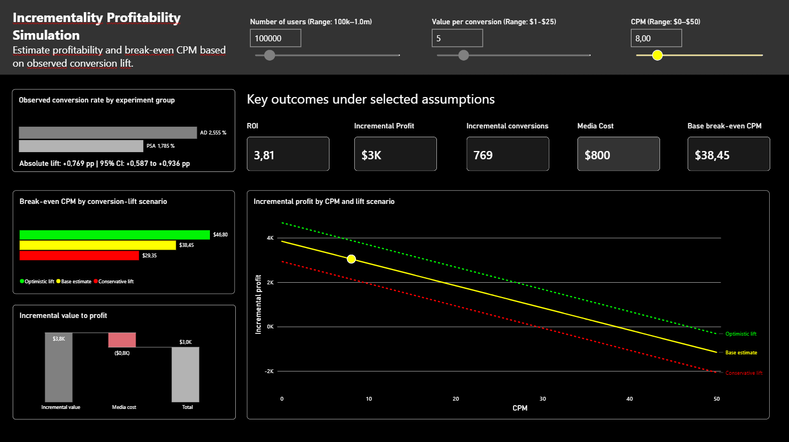

# From Experiment to Impact

## A/B Test Evaluation and Campaign Scenario Planning

This project evaluates a publicly available marketing A/B test to assess whether advertising exposure is associated with a meaningful increase in recorded conversion compared with a PSA control group.

Beyond statistical significance, the project translates the observed conversion difference into transparent business scenarios for campaign reach, contribution margin, media cost, incremental profit, ROI, and break-even CPM.



## Business question

> Does the advertising treatment outperform the PSA control group, and under which assumptions would the estimated conversion lift create meaningful incremental business value?

## Project objectives

- Validate and prepare a user-level A/B test dataset.
- Compare recorded conversion rates for the advertising and PSA groups.
- Estimate absolute and relative conversion lift with uncertainty intervals.
- Assess statistical and practical significance.
- Explore conversion patterns by day, hour, and ad exposure.
- Build conservative, base-case, and upside business scenarios.
- Translate analytical results into a decision-oriented recommendation.
- Provide an interactive Power BI scenario planner for profitability and break-even analysis.

## Dataset

The project uses the **Marketing A/B Testing** dataset published by Favio Vázquez on Kaggle.

- **Source:** [Marketing A/B Testing – Kaggle](https://www.kaggle.com/datasets/faviovaz/marketing-ab-testing)
- **Unit of analysis:** User-level experiment record
- **Scale:** 588,101 records
- **Groups:** `ad` treatment group and `psa` control group
- **Primary outcome:** Recorded conversion
- **License:** CC0 1.0 / Public Domain

The dataset is described as a marketing campaign experiment with an advertising treatment group and a PSA control group.

## Key findings

The advertising group recorded a higher conversion rate than the PSA group:

| Metric | Result |
|---|---:|
| Advertising conversion rate | 2.555% |
| PSA conversion rate | 1.785% |
| Absolute conversion lift | +0.769 percentage points |
| 95% confidence interval | +0.587 pp to +0.936 pp |

The observed difference is statistically significant. The business interpretation, however, depends on the value of an incremental conversion and the cost of reaching users.

## Analysis plan

### Primary analysis

The primary comparison evaluates whether recorded conversion rates differ between:

```text
Treatment: users assigned to the advertising group
Control: users assigned to the PSA group
```

Key outputs:

- Conversion rate by group
- Absolute conversion lift in percentage points
- Relative conversion lift
- 95% confidence interval
- Statistical test result
- Incremental conversions per 100,000 users reached

### Scenario analysis

The source data do not include revenue, contribution margin, campaign cost, or customer lifetime value. Financial outcomes are therefore modeled through explicit assumptions rather than treated as observed facts.

```text
Incremental conversions
= Campaign reach × estimated conversion lift

Incremental value
= Incremental conversions × assumed contribution value per conversion

Media cost
= (Campaign reach / 1,000) × assumed CPM

Incremental profit
= Incremental value − media cost
```

The Power BI scenario planner models three conversion-lift scenarios:

| Scenario | Conversion-lift assumption | Interpretation |
|---|---|---|
| Conservative | Lower confidence-bound lift | More cautious business case |
| Base case | Point-estimate lift | Central scenario |
| Optimistic | Upper confidence-bound lift | Upside scenario |

### Break-even CPM

The dashboard calculates the maximum CPM at which the campaign remains profitable:

```text
Break-even CPM
= Conversion lift × contribution value per conversion × 1,000
```

Interpretation:

```text
Selected CPM < Break-even CPM  → Profitable
Selected CPM = Break-even CPM  → Break-even
Selected CPM > Break-even CPM  → Unprofitable
```

## Dashboard example

The Power BI dashboard includes interactive sliders for campaign reach, value per conversion, and CPM.

Example scenario:

| Assumption | Value |
|---|---:|
| Campaign reach | 100,000 users |
| Contribution value per conversion | $5 |
| Selected CPM | $8 |
| Observed conversion lift | +0.769 percentage points |

Illustrative base-case output:

| Metric | Result |
|---|---:|
| Incremental conversions | 769 |
| Incremental value | $3.8K |
| Media cost | $0.8K |
| Incremental profit | $3.0K |
| ROI | 3.81 |
| Base break-even CPM | $38.45 |

These values are scenario outputs, not observed campaign financial results.

## Methodological scope

This project evaluates an available experiment extract. The source does not document the original randomization mechanism, intended allocation ratio, experiment duration, conversion window, campaign economics, or customer-level value.

Results are therefore reported as differences in recorded conversion between the ad and PSA groups. A causal interpretation is conditional on valid original assignment.

Subgroup and ad-exposure analyses are exploratory. In particular, ad exposure is not treated as a pre-treatment control variable in the primary treatment-effect analysis.

## Tools

- Python
- pandas and NumPy
- SciPy and/or statsmodels
- matplotlib and seaborn
- Power BI and DAX for interactive scenario planning
- Git and GitHub

## Repository structure

```text
.
├── 01_data/
│   ├── 01_raw/                     # Original source data  [not published]
│   └── 02_processed/               # Cleaned and analysis-ready data
├── 02_notebooks/                   # Exploratory analysis and statistical testing
├── 03_outputs/                     # Tables and static charts
├── 04_dashboard/                   # Power BI scenario planner (.pbix) [not published]
├── 05_screenshots/                 # Dashboard and analysis screenshots
├── requirements.txt
└── README.md
```

## How to run

1. Clone the repository:

   ```bash
   git clone https://github.com/Thoericht/ab-test-to-business-impact.git
   ```

2. Create and activate a virtual environment.

3. Install required Python packages:

   ```bash
   pip install -r requirements.txt
   ```

4. Run the notebooks in `02_notebooks/` in numerical order.

5. Open the Power BI `.pbix` file in `04_dashboard/` to explore campaign reach, contribution value, CPM, profitability, and break-even scenarios.

## Notes

- The financial model is illustrative and assumption-driven.
- `Value per conversion` should represent contribution value after relevant variable costs, not gross revenue alone.
- The model assumes a linear relationship between CPM and media cost.
- The model does not incorporate fixed costs, frequency, duplicate reach, taxes, attribution-window effects, or platform fees.
- The dashboard is intended as a portfolio project and decision-support prototype, not as a production budget-allocation system.

## Status

🛠️ Finalizing documentation and project structure